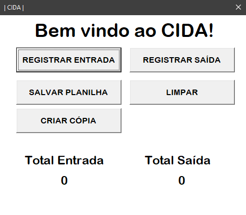
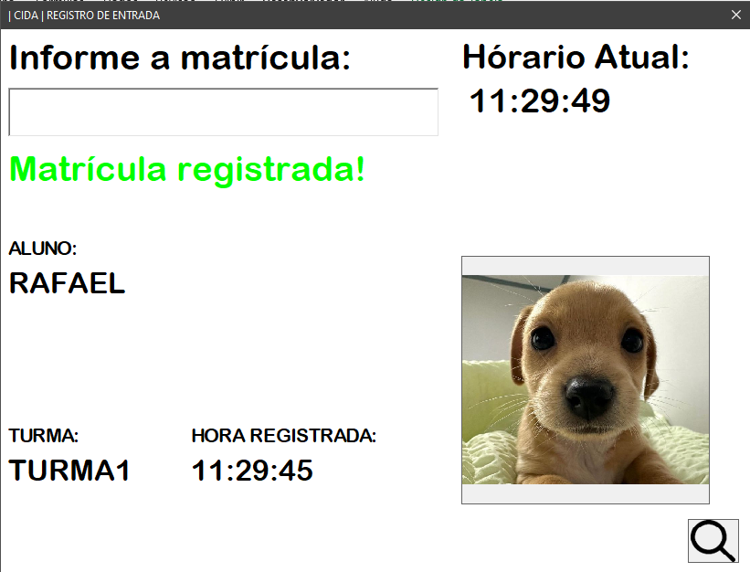
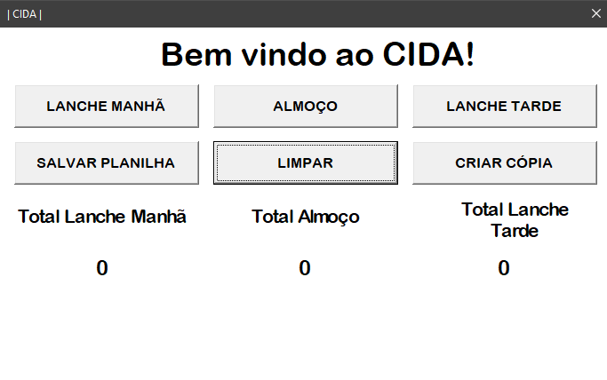
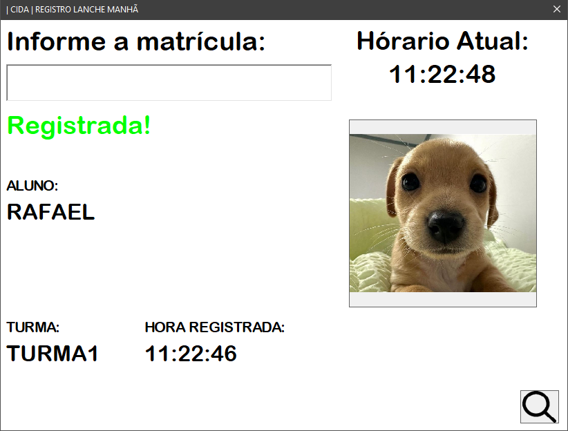
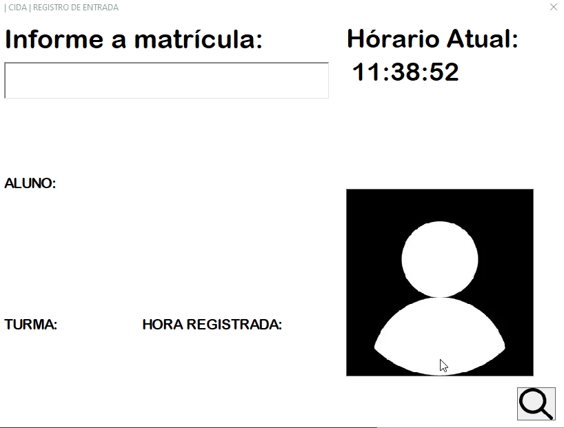

# School Access Control System (CIDA)

A student access control system that uses QR code badges to register school entry and exit, **deployed in production at CIE Miécimo da Silva, Rio de Janeiro**, developed between June 2022 and August 2023 using VBA for Microsoft Excel.

---

## Overview

The school had no reliable way to track cafeteria entries, which led to duplicate and inconsistent records. This system solved that problem: students point their QR code badge at a physical scanner, which sends the student ID to the system and instantly registers the entry. An admin operator monitors the process and handles exceptions such as students without a badge.

Due to its success, the system was later **expanded from cafeteria control to full school entry and exit tracking**, improving overall security and giving the administrative staff complete visibility into student attendance throughout the day.

The system consists of two independent spreadsheets:

| Spreadsheet | Purpose |
|---|---|
| `controle-refeitorio.xlsm` | Tracks cafeteria access: Morning Session, Lunch, and Afternoon Session |
| `controle-entrada-e-saida.xlsm` | Tracks school entry and exit |

---

## Screenshots

### School Entry & Exit Control


*Main dashboard showing entry/exit controls and daily totals*


*Entry registration form: student photo loads automatically on scan*

### Cafeteria Access


*Cafeteria Access dashboard with separate controls for each session*


*Cafeteria Access registration form: same instant photo verification*

### Registration Flow


*Full registration flow: scan badge, photo loads, access confirmed*

---

## How It Works

The system is operated by an admin who manages the full access flow. The QR code scanner eliminates manual typing: when a student's badge is scanned, the scanner inputs the 15-digit student ID directly into the active form field, and the system triggers the lookup and registration automatically. Everything else is handled by the operator.

**Daily cycle:**

1. **During the day**: the operator selects the appropriate form for the current access point (entry, exit, morning session, lunch, or afternoon session), keeps it open, and controls who passes through. When a student scans their badge, the system looks up the record, validates it, and registers the access instantly. The operator handles exceptions such as students without a badge, using the manual search form to look them up by name or class.

2. **Data safety**: the operator clicks **Save Spreadsheet** periodically to save the current state as a checkpoint, protecting against data loss from crashes or unexpected closures.

3. **End of day**: the operator clicks **Create Copy** to archive the day's records to a configured backup folder (the file is named automatically with the date and time). Then **Clear** resets the spreadsheet for the next day.

---

## Features

### Core
- **Instant QR code registration**: triggers automatically when the scanner inputs the 15-digit ID, no typing required from the operator
- **Student photo display**: loads the student's photo at check-in from a configured directory, using a `Name_ID_Class.jpg` naming convention for dynamic lookup
- **Real-time clock**: each form runs an independent 1-second update loop using `Application.OnTime`

### Access Rules
- **Duplicate prevention**: blocks re-registration of the same student ID in the same session
- **Exit requires entry**: in the school control spreadsheet, registering an exit is blocked if no entry has been recorded for that student (prevents data inconsistency)
- **ID validation**: non-numeric input is rejected immediately with a warning

### Manual Fallback
- **Manual search**: when a student has no badge, the admin can look them up by name or class via a search form; names are sorted alphabetically using a QuickSort implementation and can be filtered by class

### Data Management
- **Save Spreadsheet**: saves the current state mid-day as a safety checkpoint
- **Create Copy**: archives the day's records to a configured backup folder with an auto-generated filename (name + date + time)
- **Clear**: resets session data to prepare for the next day; the spreadsheet is briefly unprotected for the operation and re-protected immediately after

### Security
- **Password-protected spreadsheet**: data sheets are protected at all times; the system unprotects only for the instant a record is written, then re-protects immediately
- **Configurable messages**: success, duplicate, and not-found messages are customizable per deployment without touching the code

---

## My Contributions

This was a team project with 4 members. I was solely responsible for all technical development: all VBA modules, all forms, all data logic, and the system's evolution from cafeteria control to full school access tracking.

---

## Impact

- Eliminated duplicate and inconsistent cafeteria records
- Enabled visual identity verification at every access point
- Expanded scope from cafeteria to full school entry/exit after proving reliable in production
- Adopted daily by the administrative staff throughout the project period

---

## Tech Stack

- **Language:** VBA (Visual Basic for Applications)
- **Platform:** Microsoft Excel 2010+
- **Hardware:** Physical QR code scanner (HID keyboard device: inputs the student ID directly into the active form field)

---

## Prerequisites

- Microsoft Excel 2010 or higher
- Macros enabled: **File → Options → Trust Center → Trust Center Settings → Macro Settings → Enable all macros**

---

## How to Run

1. Download the `planilhas/` folder
2. Open the desired spreadsheet in Excel
3. Enable macros when prompted
4. Use the existing button or create a new one linked to: `TelaPrincipal.Show`

---

## Configuration

Both spreadsheets have a **Config** sheet where you can set:

| Setting | Description |
|---|---|
| Backup directory | Folder where daily copies will be saved |
| Photo directory | Folder where student photos are stored (`Name_ID_Class.jpg`) |
| Backup file name | Base name for backup files (date and time are appended automatically) |
| Messages | Customize the text shown for successful registration, duplicate, and not-found cases |
| Password | Password used to protect the data sheet |

> Note: Unprotect the spreadsheet before changing the password field.

---

## Code Structure

```
src/
├── entrada-saida/              # School entry/exit spreadsheet
│   ├── forms/
│   │   ├── TelaPrincipal       # Main dashboard
│   │   ├── Verificador         # Entry registration form
│   │   └── VerificadorSaida    # Exit registration form
│   └── modules/
│       ├── var.bas             # Global variables
│       ├── Relogio.bas         # Real-time clock (independent loop per form)
│       ├── NumDeRegistrados.bas# Updates daily totals on dashboard
│       ├── SalvarLimpar.bas    # Save and clear operations
│       └── ScrollMouse.bas     # Mouse scroll support in forms
│
└── refeitorio/                 # Cafeteria Access spreadsheet
    ├── forms/
    │   ├── TelaPrincipal       # Main dashboard
    │   ├── Verificador         # Morning Session registration
    │   ├── Verificador2        # Lunch registration
    │   ├── Verificador3        # Afternoon Session registration
    │   └── Pesquisa            # Manual search with QuickSort + class filter
    └── modules/
        ├── var.bas
        ├── Relogio.bas         # Three independent clock loops (one per form)
        ├── NumDeRegistrados.bas
        ├── SalvarLimpar.bas
        └── ScrollMouse.bas
```
